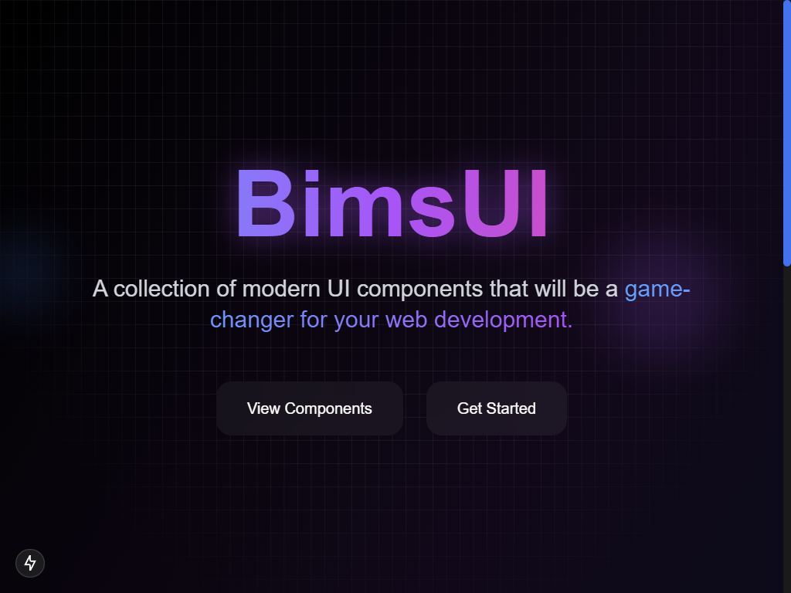

# BimsUI - Modern UI Component Library

<p align="center">
  
</p>

[](https://opensource.org/licenses/MIT)
[](https://badge.fury.io/js/bimsui)

BimsUI is a collection of modern UI components built with Next.js, Tailwind CSS, and Framer Motion. This library provides beautiful and interactive components for modern web development.

## 🚀 Getting Started

First, run the development server:

```bash
npm run dev
# or
yarn dev
# or
pnpm dev
# or
bun dev
```

Open [http://localhost:3000](http://localhost:3000) in your browser to see the result.

## ✨ Key Features

- 🎨 20+ Modern UI Components
- 📱 Responsive Across All Devices
- 🎭 Smooth Animations with Framer Motion
- 🎯 Easy to Use and Customize
- 📦 Zero Dependencies
- 🌙 Dark Mode Support
- 🚀 Optimal Performance

## 🎯 Available Components

### Animations & Effects
- Hero Parallax
- Animated Gradient Background
- Gooey Text Effect
- Text Reveal
- Scroll Animation
- Canvas Animation
- 3D Card Effect

### Navigation
- Anime Navbar
- Floating Dock
- Timeline
- Floating Button

### Interaction
- Link Preview
- Animated Tooltip
- Interactive Icons
- Highlighter
- Lens Effect

### Layout
- Shape Landing Hero
- Spline Integration
- Carousel

## 📚 Documentation

To learn more about BimsUI and Next.js, take a look at the following resources:
- [BimsUI Documentation](https://ui.bimadev.xyz) - learn about BimsUI features and components.
- [Next.js Documentation](https://nextjs.org/docs) - learn about Next.js features and API.
- [Learn Next.js](https://nextjs.org/learn) - an interactive Next.js tutorial.

## 🛠 Tech Stack

This project is built with:
- [Next.js 14](https://nextjs.org/)
- [Tailwind CSS](https://tailwindcss.com/)
- [Framer Motion](https://www.framer.com/motion/)
- [TypeScript](https://www.typescriptlang.org/)

## 🚀 Deployment

The easiest way to deploy your Next.js app is to use the [Vercel Platform](https://vercel.com/new?utm_medium=default-template&filter=next.js&utm_source=create-next-app&utm_campaign=create-next-app-readme) from the creators of Next.js.

Check out the [Next.js deployment documentation](https://nextjs.org/docs/app/building-your-application/deploying) for more details.

## 🤝 Contributing

We love contributions from our community! If you'd like to contribute:

1. Fork the repository
2. Create your feature branch (`git checkout -b feature/AmazingFeature`)
3. Commit your changes (`git commit -m 'Add some AmazingFeature'`)
4. Push to the branch (`git push origin feature/AmazingFeature`)
5. Open a Pull Request

## 📝 License

Distributed under the MIT License. See `LICENSE` for more information.

## 👨‍💻 Author

**Bima Jovanta**
- Website: [bimadev.xyz](https://bimadev.xyz)
- Instagram: [@biimaa_jo](https://instagram.com/biimaa_jo)
- Github: [@bimadevs](https://github.com/bimadevs)

## 💖 Support

If you like this project, please give it a ⭐️ on Github and share it with your community!
